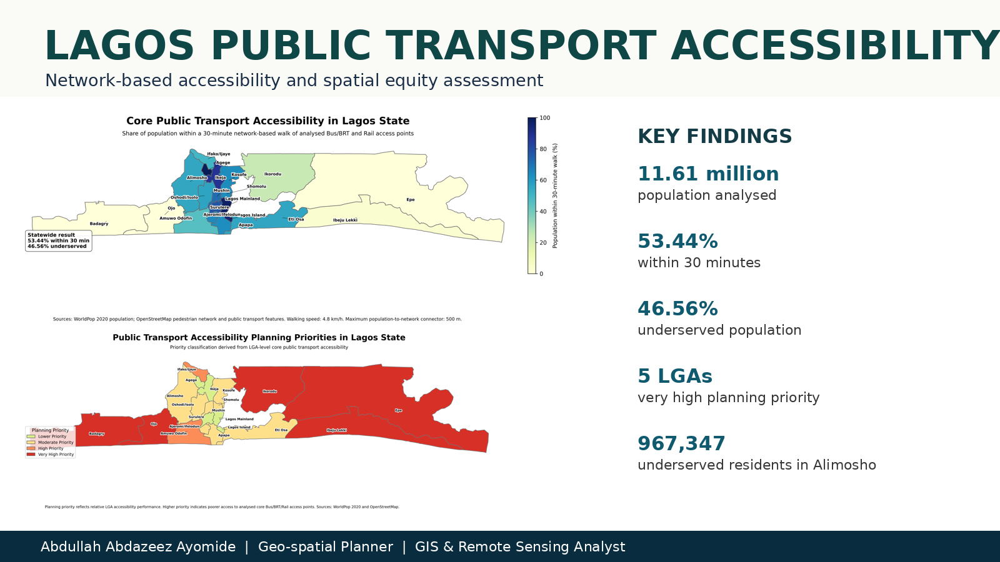
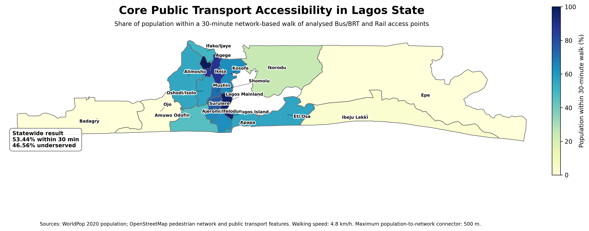
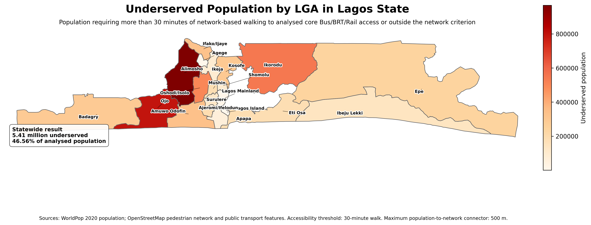
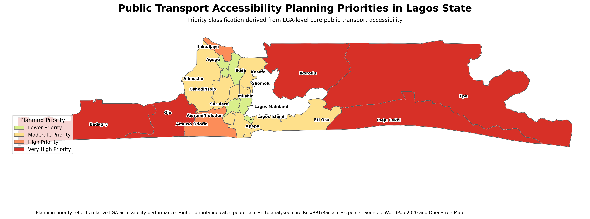
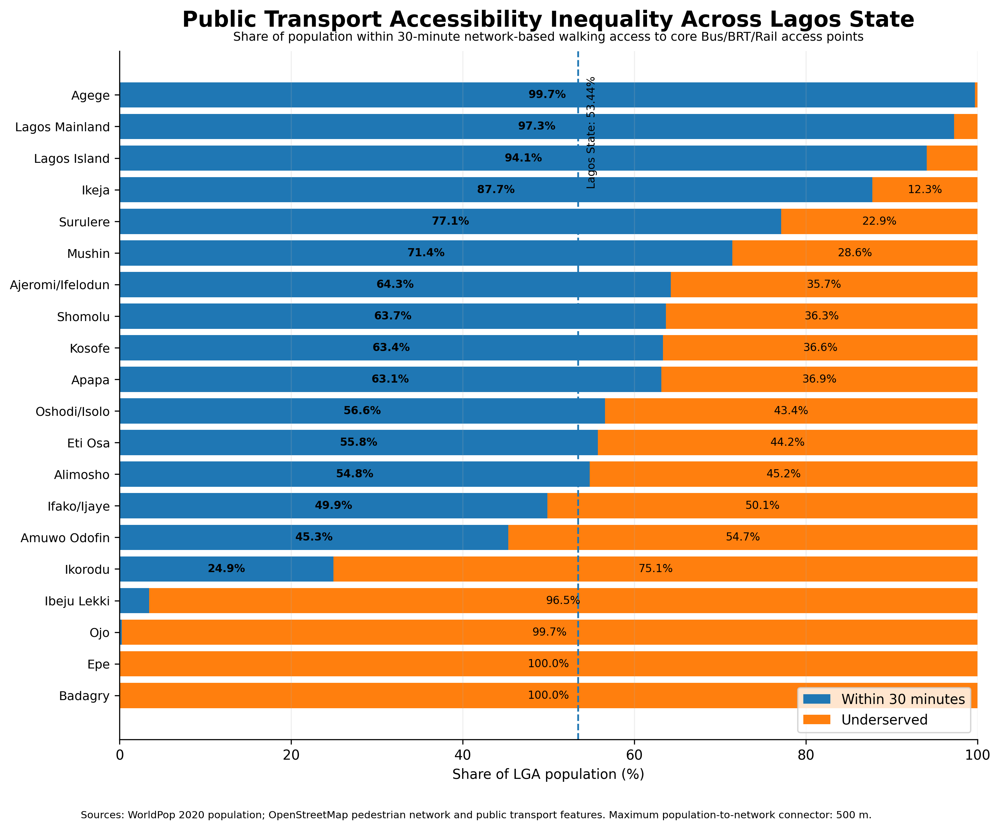
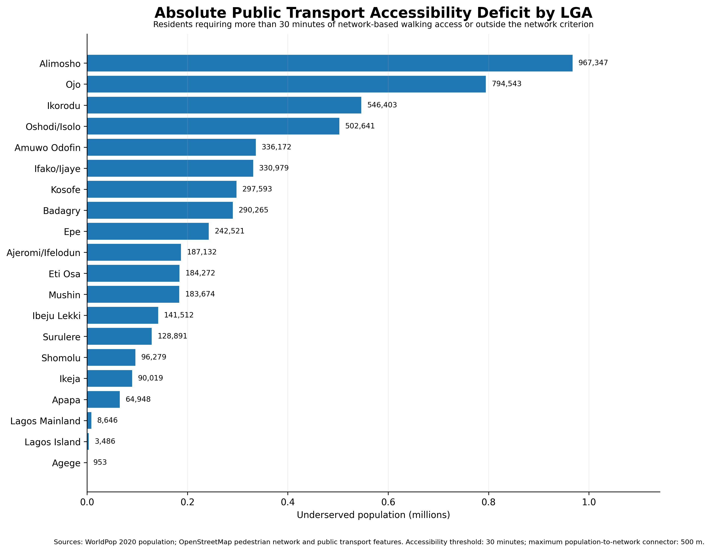

<p align="center">
  
</p>

# Public Transport Accessibility and Spatial Equity in Lagos State

Lagos has an extensive public transport system, yet proximity to bus and rail access remains uneven across the state. This project integrated OpenStreetMap pedestrian networks and transport features with WorldPop population data to measure walking-time access to core bus and rail points and identify communities where limited access overlaps with high population demand.

The analysis modelled the shortest walking route from **129,815 network nodes** to **219 core bus and rail access points**. Of the **11.61 million people** analysed, **6.21 million (53.44%)** were estimated to live within a 30-minute network-based walk, while **5.41 million (46.56%)** were classified as underserved because they exceeded the threshold or could not be connected to the analysed network within 500 metres. The results reveal a pronounced centre–periphery divide: Agege recorded **99.70%** accessibility, while Badagry, Epe, Ojo, Ibeju Lekki and Ikorodu formed the five very-high-priority LGAs.

| Project detail | Information |
|---|---|
| **Study area** | Lagos State, Nigeria — 20 LGAs |
| **Population baseline** | WorldPop 2020 |
| **Transport focus** | Core bus and rail access points |
| **Network** | OpenStreetMap walk network |
| **Walking speed** | 4.8 km/h |
| **Accessibility threshold** | 30 minutes |
| **Maximum population-to-network connector** | 500 m |
| **Projection** | WGS 84 / UTM Zone 31N (EPSG:32631) |

## Key findings

- **11,613,844 people** were included in the statewide accessibility assessment.
- **11,030,270 people (94.98%)** were connected to the analysed pedestrian network.
- **6,206,185 people (53.44%)** were within a 30-minute walk of a core bus or rail access point.
- **5,407,659 people (46.56%)** were classified as underserved.
- **Alimosho** had the largest absolute accessibility deficit, with approximately **967,347 underserved residents**.
- **Ojo** followed with **794,543 underserved residents**, while **Ikorodu** recorded about **546,403**.
- The five LGAs with the largest underserved populations accounted for **58.3%** of the LGA-assigned deficit.
- Planning priorities comprised **5 very-high**, **2 high**, **8 moderate**, and **5 lower-priority LGAs**.

## Project maps

| 30-minute accessibility | Underserved population |
|---|---|
|  |  |

<p align="center">
  
</p>

## Accessibility inequality

| LGA comparison | Absolute underserved population |
|---|---|
|  |  |

The highest accessibility levels were concentrated in the established metropolitan core. Agege, Lagos Mainland and Lagos Island recorded 30-minute accessibility rates of **99.70%**, **97.26%**, and **94.08%**, respectively. Peripheral LGAs showed substantially weaker access: Badagry recorded **0.00%**, Epe **0.01%**, Ojo **0.27%**, Ibeju Lekki **3.46%**, and Ikorodu **24.93%**.

## Analytical workflow

1. Lagos State and 20 LGA boundaries were standardised in EPSG:32631.
2. OpenStreetMap public-transport features were cleaned, classified and spatially deduplicated.
3. A walkable street network was assembled and validated for topology and connectivity.
4. Core bus and rail access points were snapped to the pedestrian network.
5. Multi-source shortest-path analysis estimated walking time to the nearest core transit point.
6. WorldPop cells were connected to nearby network nodes within a maximum 500 m connector.
7. Population was summarised at 5-, 10-, 15-, and 30-minute thresholds.
8. LGA-level accessibility, underserved population and planning-priority classes were calculated.

The archived full network is not committed because it exceeds practical GitHub browser-upload limits. A compact sample is provided, while the included Python scripts document how to regenerate the network and reproduce the accessibility workflow from current OpenStreetMap data.

## Planning relevance

The results identify where transport investment can reduce the largest spatial-access deficits. The peripheral pattern suggests that network extensions, feeder services and multimodal interchange improvements should be assessed alongside population growth in Badagry, Epe, Ojo, Ibeju Lekki and Ikorodu. Alimosho also requires attention because its moderate percentage deficit translates into the largest absolute number of underserved residents. These outputs are suitable for strategic screening and prioritisation, not parcel-level route or station design.

## Repository contents

```text
.
├── assets/                         # Project cover and social preview
├── data/
│   ├── processed/                  # Boundaries, stops, accessibility layers, raster and tables
│   └── sample/                     # Compact walk-network sample
├── docs/                           # Data, methodology, results and limitations
├── notebooks/                      # Results-review notebook
├── outputs/
│   ├── maps/                       # Final accessibility and priority maps
│   └── charts/                     # Comparison and ranking figures
├── reports/                        # Concise project summary
├── scripts/python/                 # Network, accessibility and validation scripts
├── validation/                     # Automated repository checks
├── CITATION.cff
├── LICENSE
├── README.md
├── RELEASE_NOTES_v1.0.0.md
├── requirements.txt
└── project.json
```

## Reproducibility

1. Install the packages in `requirements.txt`.
2. Review [`docs/DATA_SOURCES.md`](docs/DATA_SOURCES.md) and [`docs/METHODOLOGY.md`](docs/METHODOLOGY.md).
3. Use `scripts/python/01_download_walk_network.py` to regenerate a current OSM walk network.
4. Run `scripts/python/02_compute_network_accessibility.py` to derive node-level walk times.
5. Use `scripts/python/03_summarize_population_accessibility.py` to aggregate WorldPop accessibility.
6. Run `python scripts/python/reproduce_summary.py` to verify the supplied project results.

OpenStreetMap changes continuously, so a newly downloaded network may not exactly match the archived 2026 project network. The supplied maps, tables and node-accessibility layer preserve the analysed results.

## Limitations

The analysis measures access to mapped bus and rail points, not service frequency, affordability, reliability, safety, vehicle capacity or transfer penalties. Walking speeds and the 500 m population-to-network connector are modelling assumptions. WorldPop estimates and OpenStreetMap completeness introduce additional uncertainty. See [`docs/LIMITATIONS.md`](docs/LIMITATIONS.md).

## Author

**Abdullah Abdazeez Ayomide**  
Geo-spatial Planner | GIS & Remote Sensing Analyst

- [GitHub](https://github.com/Abdullahabdazeez)
- [LinkedIn](https://ng.linkedin.com/in/abdazeez-abdullah-4b814719a)
- [Email](mailto:abdazeezabdullah1@gmail.com)

## Citation and licence

Citation metadata is provided in [`CITATION.cff`](CITATION.cff). Code is released under the MIT License. External data remain subject to their providers' terms.
