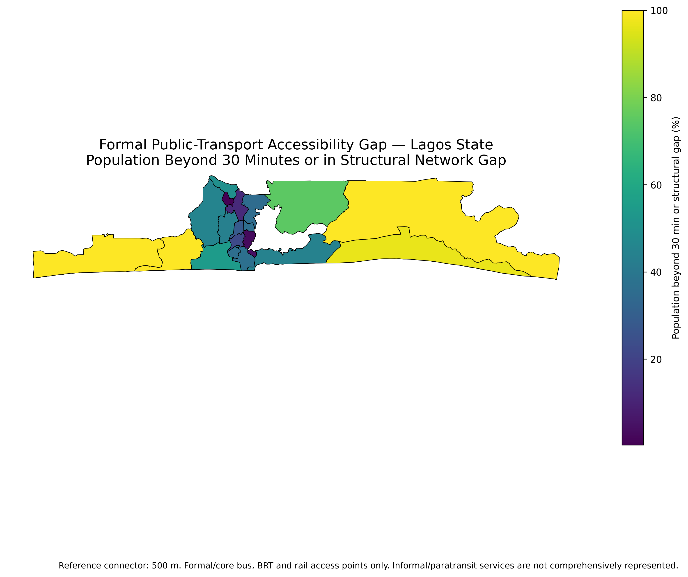
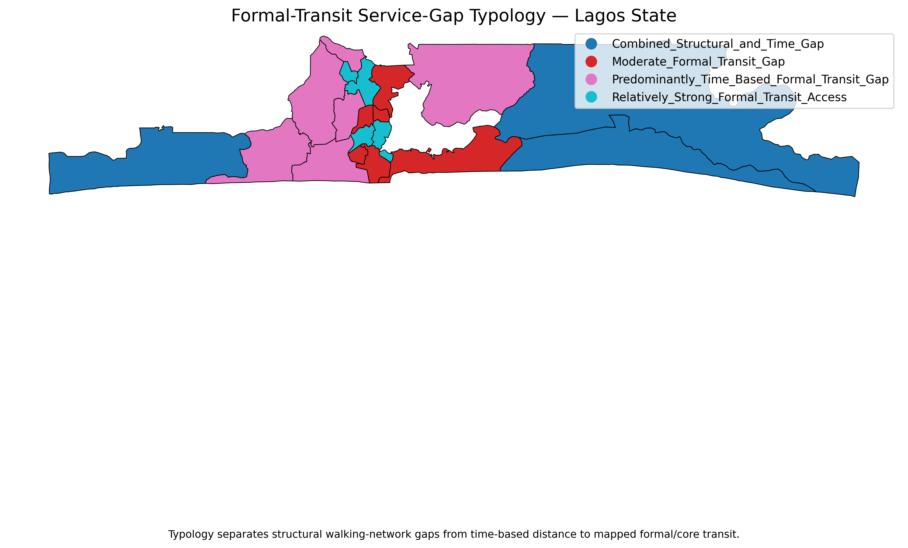
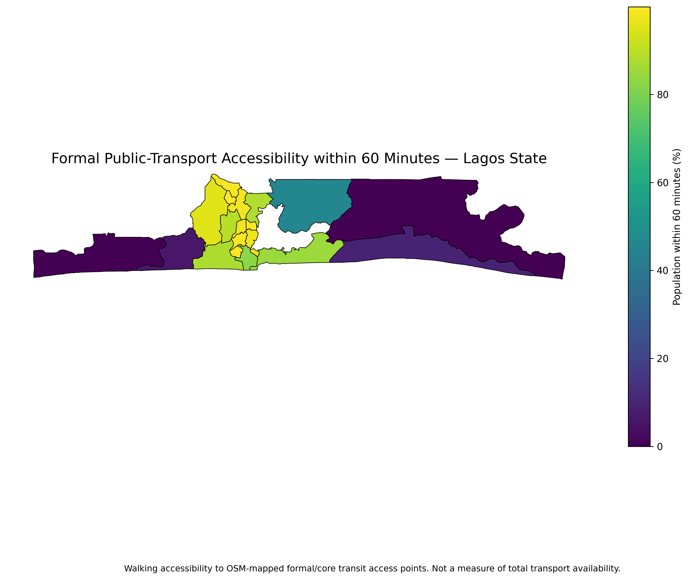

# Lagos Formal Public-Transport Accessibility and Service Gaps

  

## What this project asks

How easily can Lagos residents reach the city's **mapped formal/core public-transport network** on foot, and where are the largest gaps?

I combined a pedestrian street network, WorldPop 2020 population data and **219 mapped formal/core bus, BRT and rail access points**. The analysis estimates walking access at **15, 30, 45 and 60 minutes** and also checks how sensitive the result is to the way population cells are connected to the walking network.

The main result is that access is uneven. Under the reference model, **53.44% of the analysed population is within 30 minutes of mapped formal transit**, while **46.56% is either farther away or affected by a structural walking-network gap**.

> **Scope matters:** this project does not comprehensively map danfo, okada, keke or other informal/paratransit services. The results describe access to the mapped formal/core system, not the absence of transport generally.

### Explore the result interactively

[**Open the interactive Lagos formal-transit accessibility map in GIS Cloud →**](https://editor.giscloud.com/map/3258055)

The interactive map is built from the project's final LGA-level GIS output. Click an LGA to inspect its analysed population, share within 30 minutes of mapped formal transit, remaining formal-access gap and service-gap type. The web layer is simplified for fast viewing; the repository and project archive retain the authoritative analysis data.

## Main findings

| Walking-time threshold | Population within threshold | Share |
|---|---:|---:|
| 15 minutes | **2,557,743** | **22.02%** |
| 30 minutes | **6,206,326** | **53.44%** |
| 45 minutes | **8,350,756** | **71.90%** |
| 60 minutes | **9,232,088** | **79.49%** |

At 30 minutes, **5,407,518 people (46.56%)** are outside the mapped formal/core accessibility threshold or fall within a structural network gap under the 500 m reference connector.

Peripheral LGAs show some of the weakest formal-network access. Under the reference model, Badagry records a **100.00% formal-transit service gap**, Epe **99.99%**, Ibeju-Lekki **96.54%**, and Ikorodu **74.98%**.

## A closer look at the service gap

  

The **46.56%** figure should not be read as "46.56% of Lagos has no transport." It combines two different problems:

- people who are connected to the walking network but are still more than 30 minutes from mapped formal transit; and
- people whose population locations cannot be connected reliably to the analysed pedestrian graph under the reference connector.

That distinction matters in Lagos, where informal mobility is a major part of everyday travel.

## Data and model

| Project detail | Final specification |
|---|---|
| Population baseline | WorldPop 2020 |
| Analysis population | **11,613,844** |
| Formal/core transit access points | **219** |
| Walking-network nodes | **129,815** |
| Walking speed | **4.8 km/h** |
| Reference population-to-network connector | **500 m** |
| Sensitivity connectors | 250 m, 500 m, 750 m, 1,000 m |
| Walking thresholds | 15, 30, 45, 60 minutes |
| CRS | WGS 84 / UTM Zone 31N (EPSG:32631) |

## How I built the analysis

1. Standardised Lagos State and the 20 LGA boundaries.
2. Audited the mapped transit points and kept the analysis focused on the formal/core network.
3. Reconstructed the pedestrian network and checked its connected components.
4. Snapped the 219 transit access points to the network.
5. Connected WorldPop population cells to the walking graph.
6. Tested 250 m, 500 m, 750 m and 1,000 m connectors rather than assuming one distance was automatically correct.
7. Kept population outside the connector threshold in the denominator instead of dropping it.
8. Calculated shortest walking time to the nearest mapped formal/core transit point.
9. Summarised access at 15, 30, 45 and 60 minutes and by LGA.
10. Separated time-based access problems from structural network gaps before interpreting the result.

## Sensitivity check

The statewide 30-minute result remains stable across the tested 250–1,000 m connector scenarios. I therefore keep **500 m** as the reference because it preserves comparability with the original analysis while the alternative distances remain documented as sensitivity tests.

The connector is simply a modelling bridge between a population-cell centroid and the walking graph. It is not a recommended universal walking standard.

## Another view: 60-minute accessibility

  

The longer threshold shows how access improves as the walking catchment expands, but it also reinforces the same broad pattern: the mapped formal/core network is much easier to reach in some parts of Lagos than others.

## What this means for planning

The maps can help identify places where formal-network expansion, feeder services, safer walking links or first/last-mile improvements deserve attention. They can also support early screening for transit-oriented development and service planning in rapidly growing peripheral areas.

They should not be used alone for investment decisions. A fuller transport assessment would also need service frequency, fares, reliability, safety, transfer burden, informal transport coverage and the quality of the pedestrian environment.

## Limitations

The biggest limitation is **modal coverage**. Informal and paratransit systems are not comprehensively represented, so a formal-network gap is not the same thing as total transport deprivation.

The model also assumes a constant walking speed and does not directly account for crossings, pavement quality, personal mobility constraints, waiting time, congestion, fare affordability or service reliability. WorldPop is a modelled population surface rather than household-level census data.

See [`docs/LIMITATIONS.md`](docs/LIMITATIONS.md) for the full limitation register.

## Outputs

The repository contains the final accessibility maps, threshold charts, connector-sensitivity results, LGA service-gap summaries, GIS data and the final technical report.

## Tools

Python · OSMnx · NetworkX · GeoPandas · Pandas · WorldPop · OpenStreetMap · GIS · Matplotlib

## Author

**Abdullah Abdazeez Ayomide**  
Geospatial Planner · GIS & Remote Sensing Analyst

[GitHub](https://github.com/Abdullahabdazeez) · [LinkedIn](https://ng.linkedin.com/in/abdazeez-abdullah-4b814719a)

## Citation and licence

Citation metadata is provided in [`CITATION.cff`](CITATION.cff). Code and original documentation are released under the repository licence; external datasets remain subject to their providers' terms.